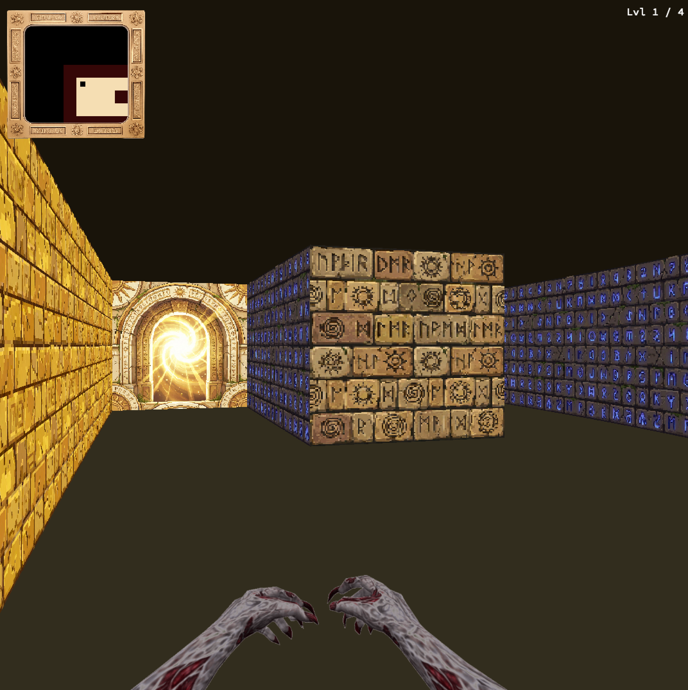

*This project has been created as part of the 42 curriculum by Aakritah & Anktiri .*

# Cub3D - My First RayCaster

A 3D maze exploration game inspired by Wolfenstein 3D. Navigate through multi-floor mazes using ray-casting rendering, find portals to advance levels, and escape the labyrinth.




## Description

Cub3D implements a first-person 3D maze Using ray-casting principles similar to those pioneered by Id Software in Wolfenstein 3D (1992) . The game features textured walls, interactive doors, a multi-floor progression system, and smooth player controls. Explore each level, find the escape portal, and advance through increasingly complex floors to complete your escape.

### Key Features

- Real-time 3D ray-casting engine with textured walls
- Multi-floor progression system with portal transitions
- Interactive doors with proximity-based auto-closing
- Full-screen navigable map overlay
- Mouse lock system for FPS-style camera control
- Customizable floor and ceiling colors
- Animated sprites and collision detection

## Instructions

### Prerequisites

- GCC compiler
- Make
- miniLibX library
- Math library (-lm)
- X11 (for Linux) or appropriate graphics libraries for your OS

### Compilation

```bash
make        # Compile the project
make clean  # Remove object files
make fclean # Remove all generated files
make re     # Recompile everything
```

### Usage

```bash
./cub3D path/to/map.cub
```

### Controls

| Key | Action |
|-----|--------|
| W/A/S/D | Move forward/left/backward/right |
| Mouse | Rotate camera (when locked) |
| ← → | Rotate camera left/right |
| F | Open nearby doors |
| V | Activate Portal |
| M | Toggle full-screen map view |
| L | Lock/unlock mouse for camera control |
| ESC | Exit program |

**Map Mode:** When M is pressed, use arrow keys to navigate the full map. Press M again to resume gameplay.

## Map File Format (.cub)

### Configuration Elements

```
NO ./path_to_the_North_texture    # North wall texture
SO ./path_to_the_South_texture    # South wall texture
WE ./path_to_the_West_texture     # West wall texture
EA ./path_to_the_East_texture     # East wall texture
DR ./path_to_the_Door_texture     # Door texture
PR ./path_to_the_Portal_texture   # Portal texture

LV ./maps/level2.cub            # Next level map file

F 220,100,0                     # Floor color (RGB: 0-255)
C 225,30,0                      # Ceiling color (RGB: 0-255)
```

### Map Characters

- `0` - Walkable space
- `1` - Wall
- `2` - Closed door
- `3` - Open door
- `4` - Escape portal (advances to next level)
- `N/S/E/W` - Player start position and orientation

### Map Rules

- Must be surrounded by walls
- Only one player start position
- Map content must be last in the file
- Spaces are valid within the map

### Error Handling

The program will exit with an error message ("Error\n" followed by details) if:
- Invalid map format or configuration
- Missing textures or invalid paths
- Invalid color values
- Map not closed by walls
- Invalid characters in map
- Misconfigured .cub file

### Complete Example

```
NO Tools/textures/levels/.../north_red.png
EA Tools/textures/levels/.../east_red.png
SO Tools/textures/levels/.../south_red.png
WE Tools/textures/levels/.../west_red.png

DR Tools/textures/levels/.../door_red.png
PR Tools/textures/levels/.../portal_red.png

LV ./maps/level2.cub

F 220,100,0
C 225,30,0

1111111111111111111111111
1000000000110000000000001
1011000001110000002000001
1001000000000000000000001
111111111011000001110000000000001
100000000011000001110111111111111
11110111111111011100000010001
11110111111111011101010010001
11000000110101011100000010001
10000000000000001100000020001
10000000000000001101010010001
11000001110101011111011140N0111
11110111 1110101 101111010001
11111111 1111111 111111111111
```

## Technical Implementation

### Gameplay

**Objective:** Navigate through multiple maze floors to escape. Find the portal on each level to advance.

### Ray-Casting Algorithm

The ray-casting engine works by:
1. Casting rays from the player position for each vertical screen column
2. Calculating ray-wall intersection using DDA (Digital Differential Analysis) algorithm
3. Computing wall height based on distance from player
4. Rendering textured wall slices with appropriate texture mapping
5. Drawing floor and ceiling with specified colors

### Graphics Pipeline

- **Input Handling** - Keyboard and mouse events via miniLibX
- **Game Logic** - Player movement, collision detection, door interactions
- **Rendering** - Ray-casting, texture mapping, sprite rendering
- **Display** - Frame buffer management and screen updates

## Resources

### Ray-Casting & Graphics
- [Lode's Computer Graphics Tutorial - Raycasting](https://lodev.org/cgtutor/raycasting.html) - Comprehensive ray-casting guide
- [Wolfenstein 3D Source Code](https://github.com/id-Software/wolf3d) - Original game implementation
- [Ray-Casting Tutorial](https://permadi.com/1996/05/ray-casting-tutorial-table-of-contents/) - F. Permadi's classic tutorial

### miniLibX Documentation
- [42 Docs - miniLibX](https://harm-smits.github.io/42docs/libs/minilibx) - Library documentation
- miniLibX man pages for function references

### Game Development
- [Game Engine Black Book: Wolfenstein 3D](https://fabiensanglard.net/gebb/index.html) - Deep dive into the original engine
- [Fast Inverse Square Root](https://en.wikipedia.org/wiki/Fast_inverse_square_root) - Optimization techniques


## Development Notes

- The project follows the 42 Norm coding standards
- All memory is properly allocated and freed (no leaks)
- Window management handles minimize/maximize/close events correctly
- The program handles edge cases and invalid inputs gracefully

## Authors

Created as part of the 42 school curriculum. Developed with insights from ray-casting pioneers John Carmack and John Romero's work on Wolfenstein 3D.

## Acknowledgments

- Id Software for pioneering ray-casting technology
- 42 Network for the project specifications
- The game development community for extensive documentation and tutorials

---

*Navigate the maze. Find the portal. Escape.*